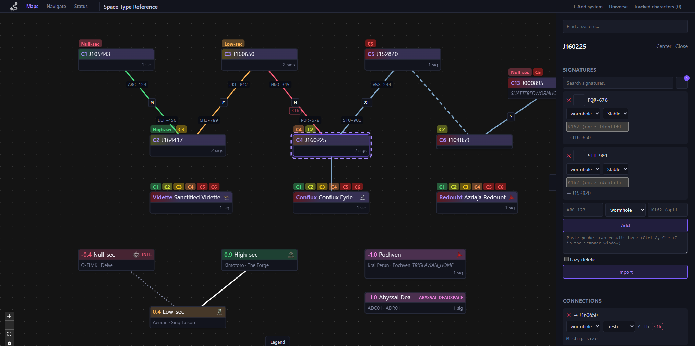
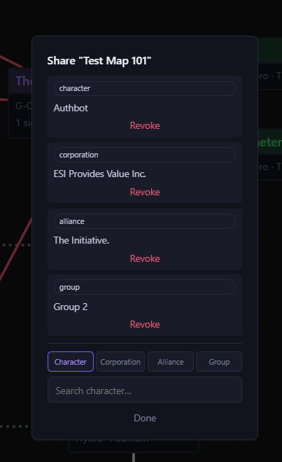
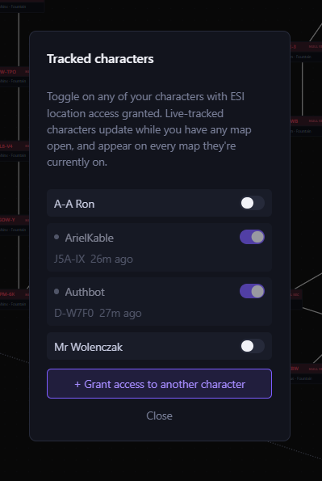
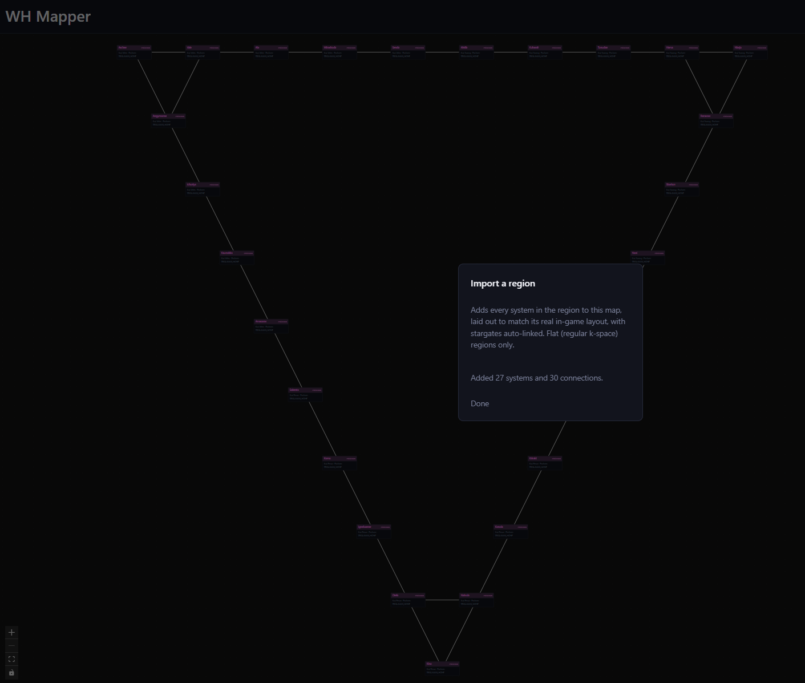

# YAWN

**Y**et **A**nother **W**ormhole **N**avigator - a live, collaborative wormhole-chain mapping plugin for [Alliance Auth](https://gitlab.com/allianceauth/allianceauth) (AA) - a Pathfinder/Tripwire-style shared map that a corp or alliance builds up together in real time, with optional live character-location tracking.




## Features

- **Live, collaborative maps** - every system, signature, and connection change is pushed to everyone currently viewing a map over a websocket. No refreshing or polling.
- **Multiple maps with sharing controls** - create as many maps as you like. Each is private by default; share one with a specific character, a whole corporation, a whole alliance, or an Alliance Auth group. Search your maps by name once you have more than a few.
- **Signatures with a real wormhole-type catalog** - log a system's cosmic signatures and pick its wormhole type from an autocomplete backed by real EVE dogma data (max mass, max jump mass, max lifetime, leads-to-class), instead of typing a code blind.
- **Bulk-paste signature import** - paste a probe scan straight from EVE's Scanner window (Ctrl+A, Ctrl+C) instead of typing each signature in by hand. Pasting the same scan again as signatures resolve updates them in place rather than creating duplicates.
- **Signature-to-connection linking** - turn a scanned wormhole signature directly into a connection: pick or add the system it leads to, then link the far side's own signature back to the same connection once it's scanned there too. The wormhole type and both signatures' IDs show right on the map edge.
- **Connections that age themselves** - wormhole, stargate, and Ansiblex connections track mass and life status. Wormhole connections automatically flip to end-of-life once their type's actual lifetime elapses, and are colour-coded green/orange/red by how much time is left.
- **Bulk region import** - pull in a whole k-space region's systems and stargate links in one action, laid out to preserve the region's real relative geography; newly-added systems auto-link to any stargate-connected neighbours already on the map.
- **Global character tracking** - grant ESI location access to one of your characters once, then toggle tracking on or off for any of your authorized characters from a single panel. A tracked character shows up live on every map you currently have open, automatically growing the map as they jump through new wormholes, and disappears the moment they go offline.
- **Guided jump prompts** - when a tracked character jumps into a wormhole connection your map didn't know about, YAWN asks which signature it was (and its type, if not identified yet) instead of leaving an anonymous connection behind. Prompts queue up so nothing gets lost if several characters jump in quick succession.

### Screenshots

| Sharing a map                                                                          | Global character tracking                                                           |
| -------------------------------------------------------------------------------------- | ----------------------------------------------------------------------------------- |
|  |  |


_Bulk region import_

## Requirements

- Alliance Auth v5+
- [django-eveonline-sde](https://github.com/Solar-Helix-Independent-Transport/django-eveonline-sde) (`eve_sde`) for solar system/region/wormhole-type reference data - will be installed automatically as a dependency however it requires it's own setup consult the link for more details.

## Installation Bare Metal

### 1. Install the package

```bash
pip install aa-wh-mapper
```

### 2. Configure Alliance Auth

Add `"channels"`, and `"wh_mapper"` to `INSTALLED_APPS` in your project's `settings/local.py`

```python
INSTALLED_APPS += [
    "channels",  # Only if not already added
    "eve_sde",  # Only if not already added
    "wh_mapper",
]
```

Wire up the channel layer used for live map updates:

```python
CHANNEL_LAYERS = {
    "default": {
        "BACKEND": "channels_redis.core.RedisChannelLayer",
        "CONFIG": {
            "hosts": [
                {
                    "address": f"redis://localhost:6379/5",
                    "socket_timeout": None,
                }
            ]
        },  # a DB index separate from Celery's broker
    },
}
```

Merge YAWN's websocket routes into your project's ASGI application (`asgi.py`):

```python
from channels.auth import AuthMiddlewareStack
from channels.routing import ProtocolTypeRouter, URLRouter
from django.core.asgi import get_asgi_application

django_asgi_app = get_asgi_application()

from wh_mapper.routing import websocket_urlpatterns

application = ProtocolTypeRouter(
    {
        "http": django_asgi_app,
        "websocket": AuthMiddlewareStack(URLRouter(websocket_urlpatterns)),
    }
)
```

Serve that ASGI application with an ASGI server (e.g. `daphne`) instead of (or in front of, via your reverse proxy) your usual WSGI server - Alliance Auth's HTTP routes keep working unchanged through `django_asgi_app` above.

Recommended: keep gunicorn serving everything else, and run `daphne` as a second process just for `/ws/` - it's a much smaller surface than your full HTTP load (one connection per open map, not per request), and this keeps gunicorn's mature sync worker model for the rest of Alliance Auth's ordinary request/response traffic:

```bash
daphne -b 127.0.0.1 -p 8001 your_project.asgi:application
```

Then route only `/ws/` to it in nginx, leaving everything else on your existing gunicorn upstream:

```nginx
upstream wh_mapper_daphne {
    server 127.0.0.1:8001;
}

server {
    # ... your existing server block (listen, server_name, ssl, etc.) ...

    location /ws/ {
        proxy_pass http://wh_mapper_daphne;
        proxy_http_version 1.1;
        proxy_set_header Upgrade $http_upgrade;
        proxy_set_header Connection "upgrade";
        proxy_set_header Host $host;
        proxy_set_header X-Forwarded-For $proxy_add_x_forwarded_for;
        # Websocket connections are long-lived - nginx's default proxy
        # timeout would otherwise silently drop an idle one and force a
        # reconnect.
        proxy_read_timeout 86400;
    }

    location / {
        proxy_pass http://your_gunicorn_upstream;
        proxy_set_header Host $host;
        proxy_set_header X-Forwarded-For $proxy_add_x_forwarded_for;
        proxy_set_header X-Forwarded-Proto $scheme;
    }
}
```

`/ws/` is matched as a prefix (not just wh_mapper's own `/ws/wh-mapper/maps/<id>/`) so any other Channels-based plugin's websocket routes are covered by the same rule without further nginx changes.

If `daphne` isn't (yet) proxied on the same origin as the rest of your site (e.g. you're pointing straight at port 8001 during setup, before nginx is wired up), set `WH_MAPPER_WS_ORIGIN` in `settings/local.py` to where it's actually reachable, so the frontend knows where to open its websocket connection:

```python
WH_MAPPER_WS_ORIGIN = "ws://localhost:8001"
```

Leave it unset for the normal setup, where a reverse proxy routes `/ws/` to `daphne` on the same origin as everything else.

The menu entry and URLs (`/wh-mapper/...`) register themselves automatically once the app is installed - no further `urls.py` changes needed.

### 3. Migrate and collect static files

```bash
python manage.py migrate
python manage.py collectstatic
```

### 4. Schedule the background tasks

Add these to `CELERYBEAT_SCHEDULE` in `settings/local.py`:

```python
CELERYBEAT_SCHEDULE["wh_mapper_poll_tracked_character_locations"] = {
    "task": "wh_mapper.tasks.poll_tracked_character_locations",
    "schedule": crontab(
        minute="*"
    ),  # a fallback kick - it self-reschedules every ~10s while anyone's online
}
CELERYBEAT_SCHEDULE["wh_mapper_age_wormhole_connections"] = {
    "task": "wh_mapper.tasks.age_wormhole_connections",
    "schedule": crontab(minute="*/5"),
}
CELERYBEAT_SCHEDULE["wh_mapper_refresh_system_sovereignty"] = {
    "task": "wh_mapper.tasks.refresh_system_sovereignty",
    "schedule": crontab(minute="0"),
}
CELERYBEAT_SCHEDULE["wh_mapper_prune_stale_map_presence"] = {
    "task": "wh_mapper.tasks.prune_stale_map_presence",
    "schedule": crontab(
        minute="*/2"
    ),  # catches a connection whose disconnect() never fired (e.g. a worker crash)
}
CELERYBEAT_SCHEDULE["wh_mapper_prune_stale_routes"] = {
    "task": "wh_mapper.tasks.prune_stale_routes",
    "schedule": crontab(minute="30"),  # deletes any shared Route unviewed for 48h
}
```

### 5. Grant permissions

YAWN defines two permissions:

- `wh_mapper.basic_access` - can access the app and create/use maps
- `wh_mapper.admin_access` - can manage or delete any map, not just their own

Grant `basic_access` to whichever states/groups should be able to use it.

### 6. (Optional) Enable character tracking

Character tracking needs your EVE SSO application (in the [developer portal](https://developers.eveonline.com/)) to include these scopes:

- `esi-location.read_location.v1`
- `esi-location.read_online.v1`

Once `eve_sde`'s SDE data is imported, populate the wormhole-type catalog (mass/jump-mass/lifetime, derived from dogma data) with:

```bash
python manage.py wh_mapper_derive_wormhole_types
```

Re-run this after every SDE re-import to pick up any new wormhole types.

## Docker

If you're running Alliance Auth via its [official docker-compose setup](https://gitlab.com/allianceauth/allianceauth/-/tree/master/docker), the steps above map onto that repo's `docker/` directory as follows - see its own `docs/installation-containerized/docker.md` for the general custom-package workflow this follows.

### 1. Add the package

Add `aa-wh-mapper` and `daphne` to `aa-docker/conf/requirements.txt` (one package per line, a version pin recommended)

### 2. Configure Alliance Auth

Add the same `INSTALLED_APPS` entries from step 2 above to `aa-docker/conf/local.py`. Point `CHANNEL_LAYERS` at the compose `redis` service, using a database index separate from the broker (`0`) and cache (`1`) it already uses:

```python
INSTALLED_APPS += [
    "channels",
    "eve_sde",  ## Setup this as per that applications instal details FIRST!
    "wh_mapper",
]

CHANNEL_LAYERS = {
    "default": {
        "BACKEND": "channels_redis.core.RedisChannelLayer",
        "CONFIG": {
            "hosts": [
                {
                    "address": f"redis://{os.environ.get('AA_REDIS', 'redis:6379')}/5",
                    "socket_timeout": None,
                }
            ],
        },
    }
}

ASGI_APPLICATION = "myauth.asgi.application"
```

The base image only ships a `wsgi.py`, not an `asgi.py` Create `aa-docker/conf/asgi.py`:

```python
import os

os.environ.setdefault("DJANGO_SETTINGS_MODULE", "myauth.settings.local")

from channels.auth import AuthMiddlewareStack
from channels.routing import ProtocolTypeRouter, URLRouter
from django.core.asgi import get_asgi_application

django_asgi_app = get_asgi_application()

from wh_mapper.routing import websocket_urlpatterns

application = ProtocolTypeRouter(
    {
        "http": django_asgi_app,
        "websocket": AuthMiddlewareStack(URLRouter(websocket_urlpatterns)),
    }
)
```

then add it to the `allianceauth-base` anchor's `volumes:` in `docker-compose.yml`, alongside the existing `celery.py`/`urls.py` lines:

```yaml
volumes:
  - ./conf/local.py:/home/allianceauth/myauth/myauth/settings/local.py
  - ./conf/celery.py:/home/allianceauth/myauth/myauth/celery.py
  - ./conf/urls.py:/home/allianceauth/myauth/myauth/urls.py
  - ./conf/asgi.py:/home/allianceauth/myauth/myauth/asgi.py ## this one is new
  # ...rest of the volumes unchanged
```

Add a `daphne` service to serve it, mirroring the existing `allianceauth_gunicorn` service:

```yaml
  allianceauth_daphne:
    container_name: allianceauth_daphne
    <<: [*allianceauth-base]
    entrypoint: ["daphne", "-b", "0.0.0.0", "-p", "8001", "myauth.asgi:application"]
    expose:
      - 8001
```

Then route `/ws/` to it in `docker/conf/nginx.conf`, above the existing catch-all `location /`:

```nginx
location /ws/ {
    proxy_pass http://allianceauth_daphne:8001;
    proxy_http_version 1.1;
    proxy_set_header Upgrade $http_upgrade;
    proxy_set_header Connection "upgrade";
    proxy_set_header Host $host;
    proxy_set_header X-Forwarded-For $proxy_add_x_forwarded_for;
    # Websocket connections are long-lived - nginx's default proxy timeout
    # would otherwise silently drop an idle one and force a reconnect.
    proxy_read_timeout 86400;
}
```

### 3. Build, migrate, and collect static files

```bash
docker compose --env-file=.env up -d
docker compose exec allianceauth_gunicorn bash
allianceauth update myauth
auth migrate
auth collectstatic
```

### 4. Schedule the background tasks

Add the same `CELERYBEAT_SCHEDULE` entries from step 4 above to `docker/conf/local.py`. `allianceauth_beat` picks them up on its next restart:

```bash
docker compose restart allianceauth_beat
```

### 5. Grant permissions and enable tracking

Same as steps 5-6 above - both are done from the Django admin site and your EVE SSO application's own config, not container config, so there's nothing docker-specific about either.

## Development

The backend is a [django-ninja](https://django-ninja.dev/) API (`wh_mapper/api/`) plus Django Channels websocket consumers (`wh_mapper/consumers.py`); the frontend is a React + TypeScript SPA in `frontend/`.

### Backend

```bash
python manage.py test wh_mapper
```

or, via `tox`:

```bash
make tox_tests
```

### Frontend

The prebuilt frontend lives in `wh_mapper/static/wh_mapper/`. To rebuild it after making changes in `frontend/src/`:

```bash
cd frontend
npm install
npm run build
```

`npm run dev` starts a Vite dev server on port 3000, proxying `/wh-mapper/api/` and `/ws/wh-mapper/` to a Django dev server running on port 8000.

## Contributions

All bug fixes or features must not include extra superfluous formatting changes, if you want to reformat the entire repository put it in it own request.

All Contributions big and small are welcome, we ask that if you submit code you understand how it works.

Make sure you have signed the [License Agreement](https://developers.eveonline.com/resource/license-agreement) by logging in at https://developers.eveonline.com before submitting any pull requests.
